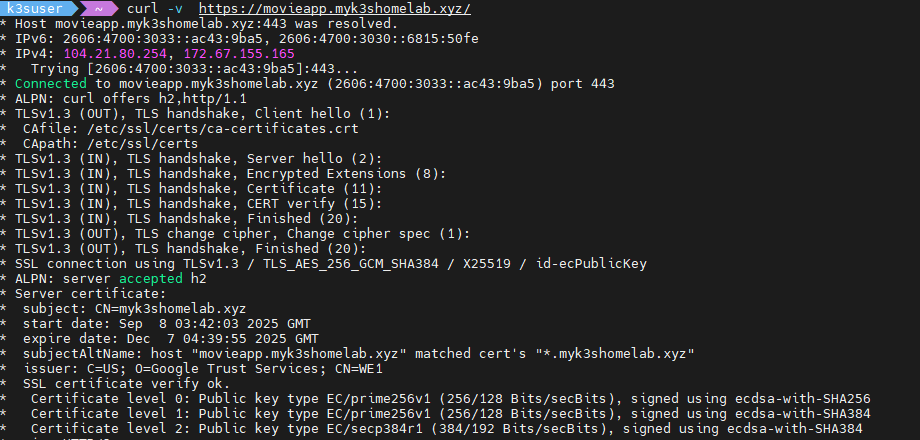

# 📚 Movie Tracker Flask APP

A simple CRUD web application built with Flask to manage and track your movie collection.

---

## 🚀 Features

* **Add Movies**: Input movie details such as title, genre, and rating.
* **View Movies**: Display a list of all movies in your collection.
* **Update Movies**: Edit existing movie details.
* **Delete Movies**: Remove movies from your collection.
* **Persistent Storage**: Utilizes SQLite for data storage.

---

## 🛠️ Technologies Used

* **Backend**: Python 3.11
* **Web Framework**: Flask
* **Database**: SQLite
* **ORM**: SQLAlchemy
* **Containerization**: Docker (Alpine-based image)

---

## 🧩 Project Structure

```
/movie-tracker-flask
├── app.py              # Main application file
├── requirements.txt    # Python dependencies
├── Dockerfile          # Containerization setup
├── LICENSE             # Project license
└── .gitignore          # Git ignore rules
```

---

## ⚙️ Setup Instructions

### 1. Clone the Repository

```bash
git clone https://github.com/s4Sachin26/movie-tracker-flask.git
cd movie-tracker-flask
```

### 2. Create a Virtual Environment

```bash
python3 -m venv venv
source venv/bin/activate  # On Windows, use `venv\Scripts\activate`
```

### 3. Install Dependencies

```bash
pip install -r requirements.txt
```

### 4. Run the Application

```bash
python app.py
```

The application will be accessible at [http://localhost:5000](http://localhost:5000).

---

## 🐳 Docker Setup

To run the application using Docker:

```bash
docker build -t movie-tracker .
docker run -d -p 5000:5000 --name movie-tracker movie-tracker
```

Access the application at [http://localhost:5000](http://localhost:5000).

---

## 📄 API Endpoints

* `GET /movies`: Retrieve all movies.
* `POST /movies`: Add a new movie.
* `PUT /movies/<id>`: Update an existing movie by ID.
* `DELETE /movies/<id>`: Delete a movie by ID.

---

## 🔐 License

This project is licensed under the MIT License. 

---

## 📸 Screenshot's 
The Movie Tracker Flask app is deployed on my homelab and exposed via Cloudflare Tunnel with TLS:



 ---
Feel free to reach out if you have any questions or need further assistance!
